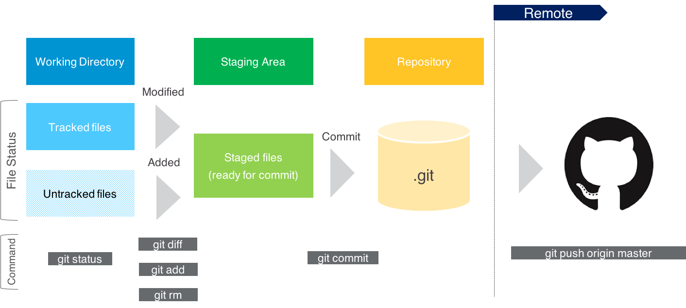
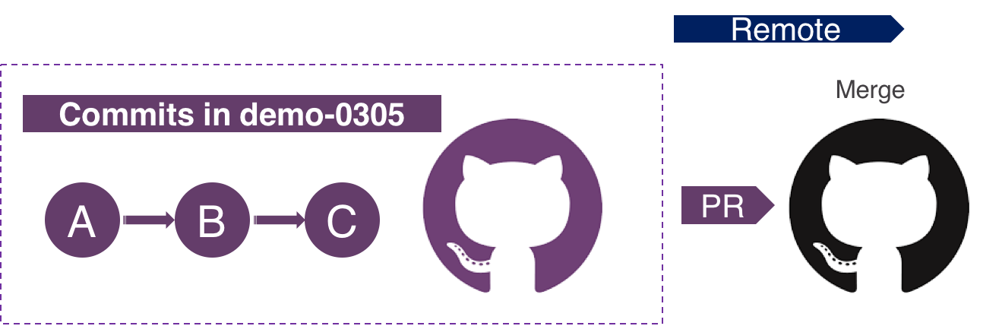
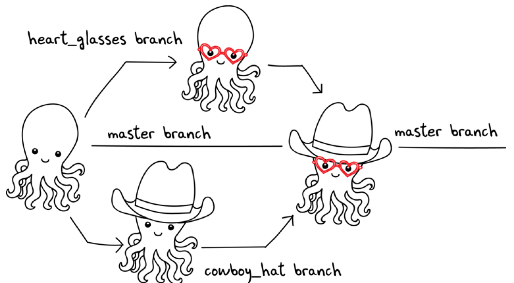
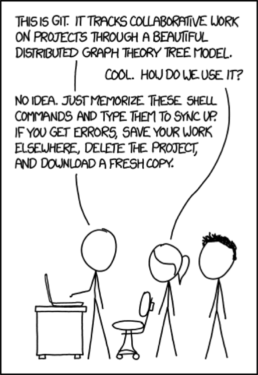

# Command-Line for Beginners

---
# Training Primer

**About me**

**We hope you can walk away from this training able to**

  * Not be intimidated by Terminal
  * Able to navigate Unix-like file system with no hassle
  * Use Git and Github for your own work and collaboration

**A few words to windows users**

  * Good news: native Ubuntu-based Bash shell is available with Win10
  * Before that: cygwin + Github's bash program

**Let us know your feedback**

Email [me](dchen@civisanalytics.com)

**Everything can be found in**
[Github Repo: danning/cli_training](https://github.com/danningc/cli_training)
(Please file issues if you find any)

.notes: we try to make this training session as hands-on as possible, but it's also possible that people come in with different levels of familiarity with command line tools. Hard to tailor. But we would like to hear from you if you happen to have the chance to use some command line tools for your work (or life), so we will know what is more practical and useful for people.

---
# Shell Utilities
---
# Agenda:

**In this session, you will:**

  * Get familiar with your Terminal program
  * Use Bash commands to navigate your file system
  * Get a sense of permissioning
  * Set up .bashrc and understand environment variables

.notes: In this module, all the actions will happen in a terminal. You can choose between Mac's default terminal "Terminal" or "iTerm" if that is installed on your machine. If you are using windows, find cygwin. Both applications provide similar functionality interfacing the operating systems. My personal preference is iTerm because it's highly configurable, open-sourced and being actively developed by the community.

---
# What is Shell or Bash?

  * A standard command language interpreter, or interface on most Unix machines
  * Type commands or instructions to the terminal windows
  * Bash is the default shell on Mac

.notes: you can switch to zsh, ksh, tcsh, fish or sh if you want. Mine default shell is zsh, but the interface is almost identical.

**So what?**

  * OS X is just a commercialized Unix-like operating system
  * Bash is essentially a programming language with a lot of flexibility
  * Bash (or other shell programs) is how people typically interact with remote machines

.notes: your Mac laptop is just a graphical interface on top of a Unix-like system. You can interact with it in a more fundamental way with Bash. Since it's essentially a programming language, you can unlock a lot of efficiency and flexibility with it. For example, you can use pipeline in Bash to connect a sequence of simple commands. You can even do data science with command line tools! Some bash commands are relevant to your day-to-day work, for example, docker, Git, and AWS s3, which we will detail later. Remote machines are usually set up in Linux environment, and the only way to interact with them is through command line interpreters, typically Bash.

---
# Using Shell Program (Bash) to Interact with File System

**On a UNIX system, everything is a file; if something is not a file, it is a process**

  * `pwd` (print working directory): prints what directory you are in
  * `cd` (change directory): moves you around
  * `ls` (list): prints objects (files and/or subdirectories)

---

# Move Around Your Home Directory

**Example commands**

    !bash
    cd ~ # home directory
    pwd # view where you are
    ls  # view files and directories under your current one
    cd .. # up one directory
    cd . # current directory
    cd /Users/danning/Downloads/ # to specified directory
    cd - # return to where you were one step before
    cd ~/Downloads # use ~ to substitute /Users/dchen/
    cd $HOME # another way to go home :)

---
# Hot Keys with Terminals

  * Auto-complete:
    * `Tab`: auto-complete command as you start typing the first couple of letters
  * Clear screen:
    * iTerm: `Ctrl + L` or `Cmd + R`
    * Terminal: `Ctrl + L` or `Cmd + L`
  * Kill running process:
    * `Ctrl + Z`: suspend the current foreground job (`bg` to make the command to execute in background)
    * `Ctrl + C`: interrupt the current running program

---
# Using Bash to Interact with File System
You can move files around using bash, creating and deleting files and directories (folders)

* `touch`: create a new and empty file
* `mkdir`: (make directory) create a new directory
* `cp`: (copy) file or directory
* `mv`: (move) or rename file or directory
* `rm` (remove) file or directory

`-r`: if the target is a directory, for example:

* `cp -r directory/ ~/Desktop/directory`: copy the whole targeted directory to the destination

---
# Using Bash to Interact with File System

**Exercise**

    !bash
    cd ~
    touch newfile.txt # create an empty file
    mkdir directory # create an empty directory in home directory
    cp newfile.txt directory/newfile.txt # copy newfile to directory
    mv newfile.txt oldfile.txt # rename newfile.txt to oldfile.txt
    ls
    mv oldfile.txt directory/oldfile.txt # move oldfile.txt to directory with the same file name
    ls
    cd directory
    ls
    rm newfile.txt # deletes a file
    mv oldfile.txt ../oldfile.txt # move oldfile.txt one level up
    cd .. # back one level up
    ls
    rm -r directory # remove directory

---
# Create New File in Command Line
You can create empty file with `touch filename`, and use your preferred text editors to edit and save. Alternatively,
use Bash command or command line's default editor.

### Approach 1: edit from GUI

    !bash
    cd $HOME
    touch newfile.txt
    open . # then start editing on the file

### Approach 2: use `cat` to input content to a new file
    !bash
    cat > newfile.txt
    # stop inputting by Ctrl + C

### Approach 3: use Bash's default editor
    !bash
    vim newfile.txt # vim creates a new file if it doesn't exist

---
# Create New File in Command Line
**Exercise**: create a file called "newfile.txt", with any content, for example:

    !bash
    hello world,
    i am a robot!
    1
    2
    3
    4
    5
    6
    7
    8
    9

## Vim Essentials:
* Normal(command) mode vs Insert mode
* Exit: Hit the `ESC` key to get into command mode then type `:q` and press `Enter` (`:wq`: save and quit)
* Insert: Type `i`

---
# Read or Preview Files
Remember the "newfile.txt" you just created:

  * `wc` (word count): shows number of lines, words, and characters in a document
  * `less`: not reading in the entire file before printing (type `q` to exit)
  * `head`: print out the first couple of lines
  * `cat` (concatenate and print): print the whole file to terminal line by line

.notes: To choose between `cat` and `less/more/most` - cat is designed to take multiple separate inputs and print them all to std out as a single unbroken stream, i.e. a pipe from input to output. While it can display a single file for reading, it's just a convenient side-effect. `less` can be thought as a text display application. It's designed to take a single input and break it up into pages that will fit the size or your display device.

---
# Enhance Commands with Arguments

  * `-`: optional arguments that come after the command
    * A single hyphen can be followed by multiple single-character flags
    * A double hyphen prefixes a single, multi-character option
  * `.`: a dot in front of the file names indicating they are "hidden" files

.notes: Bash commands often have options (typically flagged with -) that allow for differing functionality. You enter these options after the command, but before the argument (typically the file you are pointing the command at). Hidden files are not displayed by default, but you are not prevented from accessing them. They are usually used to store user preference or preserve the state of utility. We will talk about .bashrc file and credentials later, both saved as hidden files.

    !bash
    wc -l newfile.txt # only show number of lines
    head -n 1 newfile.txt # only show first line
    ls -a # show hidden files/directories
    ls -l # l = long listing, detailed info about the objects
    ls -alh # combine both commands above, plus "human readable format"

**Do not bother to remember the arguments**

    !bash
    man ls # display manual
    man --help

---
# Permissions and Sudo
Most of time, you operate in your home directory that you are allowed to mess up everything. What if you go beyond home directory?

    !bash
    cd / # move to root directory
    ls -alh # see the new user and usr group associated with each file/directory
    touch newfile.txt # permission denied

`sudo` (super user do): greater power comes with greater responsibility

    !bash
    sudo touch newfile.txt

**Ruining Everything Forever**

    !bash
    sudo rm -rf .*

And this is real, you can [destroy a company with this line of the code](http://www.independent.co.uk/life-style/gadgets-and-tech/news/man-accidentally-deletes-his-entire-company-with-one-line-of-bad-code-a6984256.html)

More reading on [Linux file permission](https://www.linux.com/learn/understanding-linux-file-permissions)

---
# Permissions and Sudo: Change Permission
**chmod** is short for change mode, it's used with either letters or numbers to set the permissions.

When creating a new file, by default the file has `-rw-r--r--` permission (read+write for owner, read-only for user group, read-only for everyone)

    !bash
    ls -al
    chmod u +x newfile.txt # add execute permission to author
    chmod u -xr newfile.txt # remove both write and execute permission from author, now try to open this file?

`u`: Owner; `g`: Group; `a`: All Users

---
# Permissions and Sudo: Change Permission

    !bash
    # letter <-> number
    rwx rwx rwx = 111 111 111 = 777
    rw- rw- rw- = 110 110 110 = 666
    rwx --- --- = 111 000 000 = 700

    chmod 700 newfile.txt # think of permission setting a series of bits
    # if you don't have the permission
    cd / # do something in root directory
    sudo touch newfile.txt
    ls -al newfile.txt
    chmod a+w newfile.txt
    sudo chmod a+w newfile.txt

**Exercise**: make your "newfile.txt" with the permission of `-rwxrw-r--`

---
# .bashrc and Environment Variables

.notes: for windows cygwin user, the corresponding files: .bashrc -> .bashrc, .bash_profile -> .profile

**What is .bashrc**

  * initialization/configuration files that control the behavior of bash
    * or, a list of Bash commands that runs automatically when starting an interactive session
  * Highly-customizable to your preference or shortcuts
  * Similar to **.bash_profile**, which is for login shell

.notes: as you have seen previously when we navigated the file space, `.` in front of a file name means it's not going to be displayed by default.

**environment variables** are a set of dynamic named values that can affect the way running processes will behave on a computer

    !bash
    env
    echo $HOME # your home directory
    echo $PATH # a list of directories where executable programs are located
    echo $SHELL # the shell program you are using in the terminal
    echo 1+1
    echo $((1+1))

.notes: `echo` is not limited to printing out environment variables, but any arguments to standard output. By saying arguments, they could be anything - variable, string, etc. And the way variable is denoted and retrieved is by adding "$" in front of the variable name.

---
# Update Environment on the Fly

### Temporary:
    !bash
    echo $DATABASE_USER # empty
    export DATABASE_USER='robot' # assign a value to the environment variable
    echo $DATABASE_USER # robot

### Available for All Sessions:
    !bash
    vim .bashrc # or any editor
    source ~/.bashrc # get the update right away

---
# Git(hub): Collaborative Workflow

---
# Agenda

**In this session, you will**

* Familiarize with major interfaces with local Git and Github
* Configure your Git locally from command line and connect it with Github
* Clone existing repo
* Collaborate with others through Github

---
# What are Git, Github and So What?

**What is Git**

**Git** is a distributed version control system for software development, initially developed by Linux kernel developers for their own development work.

**What is Github**

Git itself is strictly a command line tool, but **Github** as a web service, facilitates the collaborative component of Git.

**So what?**

* Good for tracking your code and workflow
* Good for collaboration

---
# All Roads Lead to Github
* **[Github website](https://github.com/danningc/)** is the centralized location to share the repositories, where people upload their work for share and discussion after their local work
* **Github GUI**: the GUI developed by Github that satisfies its basic needs for uploading code and collaboration
* **Git from Bash**: command line tool, more primitive, but also more powerful and flexible
  * Windows users: via Git Bash

Quick peak:

    !bash
    cd ~/Github/cli_training
    git status

---
# Git First-Time Setup

**Global config**: tell your local Git who the user is

    !bash
    git config --global user.name "danningchen"
    git config --global user.email "danningch@gmail.com"

* `.gitconfig` is Git's configuration file, created automatically after you type in the two lines of command above
* Once created, you can directly edit it as text file, or use `git config` commands and tailor it towards your preference. See [here](https://git-scm.com/book/en/v2/Customizing-Git-Git-Configuration) for more configuration options.

**Exercies: Set up Git with your user email locally**

---
## Authorize Local Git with Github using SSH

**SSH** gets you a secure, encrypted connection from your local machine to remote machine (Github) via public/private-key encryption system, which disseminate public keys to remote and keep private keys known only to the owner.

.notes: before having everyone setting up their connection, talk through the rationale behind these steps

**Exercies: SSH connection to Github**

* Generate new ssh public/secret key pair and add SSH-agent: [instruction](https://help.github.com/articles/generating-a-new-ssh-key-and-adding-it-to-the-ssh-agent/)
* Add SSH key to Github account: [instruction](https://help.github.com/articles/adding-a-new-ssh-key-to-your-github-account/)

---
# Clone Repositories
**clone** is not only downloading a local copy of all the files and scripts in this repo, but also the whole "published" history associated with this repo

Clone [cli_training](https://github.com/danningc/cli_training) into Github folder (if you want centralized location for all your repos):

    !bash
    cd ~/Github
    git clone git@github.com:civisanalytics/cli_training.git
    cd cli_training
    ls
    git status

In your local copy of the repo, you can navigate it exactly the same way as you navigate other files/directories, create and edit files.
We are just going to learn some more Bash commands specific to Git.

**Exercise**: clone [cli_training](https://github.com/danningc/cli_training) repo

### How to create your own repo:
Follow the instruction [here](https://help.github.com/articles/create-a-repo/), then clone it locally.

---
# Contribute or Collaborate on Github

.notes: if your sole goal of learning Git/Github is to clone other people's work and use it, we've achieved it. But in order to version control your own code, share it and collaborate with others, it's important to have a big picture of how Git works.

## The Three Main States of Git

  * **modified** means you have changed the file in your **working directory**, but haven't been committed to your local git database yet
  * **staged** that you have marked or added a modified file in its current version to **staging area**, to go into your next commit snapshot
  * **committed** means the data has been safely stored in your local database, or local **repository**

**Commit:**

Each **commit** stands for a snapshot of your current database. The commits are ordered and dependent on each other, like parents and children. So your commits reflect the history of code editing, and you can always go back in time.

---
## Workflow A: Local Master to Remote Master
### Diagram:

.notes: From local to remote, this is the simplest workflow you can imagine with Git and Github. You edit your code locally, and push to master.

---
## Workflow A: Local Master to Remote Master

**Example Commands:**

.notes: remind people of the three main states, modified, staged and committed

    !bash
    cd $HOME/Github/cli_training/
    git status # on master
    cat > newfile.txt
    git status # status
    git add newfile.txt
    git status
    git diff # look for difference compared with most recent commit
    git commit -m "add newfile.txt" # type in commit message

What if you want to edit existing file:
    !bash
    vim newfile.txt
    git diff
    git add newfile.txt
    git commit -m 'add author info to newfile.txt'

What if you want to remove existing file, instead of `git add`, use `git rm`  

---
## Keep an Eye on Commit History

**View commit history:**

    !bash
    git log -n -5 --oneline --graph # look at recent commit history

**Push to remote (Github):**

    !bash
    git push origin master # push to remote named "origin"

**Checkout out [commit history](https://github.com/danningc/cli_training/commits/master) on Github website**

In this way, you are basically using Github as Dropbox, but with the capability of tracking changes happening to the files.

---
## Workflow B: Branch and Merge to Master
### Branching, Merging and Pull Requests

[How to become a collaborator](https://help.github.com/articles/inviting-collaborators-to-a-personal-repository/)

  * **Branch** in Git means a "pointer" to a history of commits
    * Usually associate this series of commits with one topic or theme
  * Why **master** matters to people?
    * **master** is technically only another branch
    * But it is usually treated as the "official project"
    * We want commit history of **master** as clean and logical as possible
  * How to **branch**:
    * Start off a new branch which wraps the series of commits associated with one topic or theme
    * Push this branch to remote
    * Submit a Pull Request (PR) to request "merging" it to **master**

---
## Workflow B: Branch and Merge to Master
### Diagram

---
## Workflow B: Branch and Merge to Master
### Example Commands:

    !bash
    cd $HOME/Github/cli_training/
    git checkout -b update-readme # use a meaningful branch name
    vim README.md # add today's date
    git add README.md
    git commit -m "add today's date to readme"
    git push origin update-readme # no longer to master

While in **master**, the file `README.md` doesn't have today's date in its current snapshot.

    !bash
    git checkout master

Submit a **Pull Request** on the [website](https://github.com/danningc/cli_training), and tag a reviewer.

---
## Workflow B: Branch and Merge to Master
### Moment of Glory: Merge PR to **master**

.notes: still stay on the same webpage. Repeat the commit procedures to add something new to README.md, push again and see the changes on website

  * Submitting the PR, we can tag interested parties to do code review
  * The reviewer can post general as well as line-by-line comments to your code
  * The author adjust their work based on the comments locally, make new commit and push to the same branch.
    * Github will automatically combine all your commits from the same branch to the same Pull Request.
  * Once **LGTM**, merge branch to **master** and delete it (or not)

---
# Coordinating Multiple Branches

.notes: what happens when you collaborate with other people?

.notes: As you are working on your branch, **heart-glasses**, your peer might be working on another branch, called **cowboy-hat**, and both of you start off **master**.

---
# Coordinating Multiple Branches

**Scenario**

  * A is working on **heart-glasses**
  * B is working on **cowboy-hat**
  * Both A and B start off **master**

**What happens when both of them want to merge their work to master**

  * By default, Git will try to merge a branch in a **fast-forward** mode whenever possible
  * Assuming **heart-glasses** branch gets merged first, it would be merged to **master** in a fast-forward mode
  * What happens if you want to merge **cowboy-hat** to **master** now?
    * Git will try to do a **three-way** merge: instead of moving **master** forward, Git creates a new snapshot that results from the latest commit of the branch, i.e. **HEAD** of the branch, and the **common ancestor** of the two. The best **common ancestor** will be determined by Git.

.notes: **fast-forward**: the commit pointed by the branch you merge in is directly upstream of the commit you are on.

---
# Coordinating Multiple Branches
**Example Commands:** When you are doing non-overlapping work with your collaborator:

    !bash
    git checkout master
    git checkout -b heart-glasses # start a new branch called heart-glasses based on master
    vim README.md # add "heart-glasses" there
    git add README.md
    git commit -m 'wear heart-glasses'
    git push origin heart-glasses

    git checkout master
    vim README.md # "heart-glasses" don't exist here
    git checkout -b cowboy-hat # # start a new branch called heart-glasses based on master
    touch what_do_i_wear.txt # add "cowboy-hat" there
    git add what_do_i_wear.txt
    git commit -m 'wear cowboy-hat'
    git push origin cowboy-hat

Submit a **Pull Request** on the [website](https://github.com/danningc/cli_training).

---
## Catch Up with Your Collaborator
**Example Commands:** When others introduce changes that affect your work to `master`,
you want to incorporate them while still working on your branch

    !bash
    # sync your master with remote if it's not
    git fetch origin # download objects and refs from another repository
    git checkout master
    git merge origin/master

    # similarly, you can do that with branches
    git checkout heart-glasses
    git merge master

    git checkout cowboy-hat
    git merge master

### Outcomes from Merging

* 95% of time Git is smart enough to merge automatically
* How about the rest of 5%

---
# Coordinating Multiple Branches
## 5%: Merge Conflicts

* If the same part in the same file was changed differently in two branches you are merging together, Git won't be able to merge them automatically
* Human judgement is required to resolve the merge conflicts
* Be more specific about what each branch is designed for will help avoid the 5%

---
# Coordinating Multiple Branches
**Command Examples:** when you are editing the same line of code as your collaborator

    !bash
      git checkout master
      vim what_do_i_wear.txt #edit line 2 to "heart glasses"
      git add what_do_i_wear.txt
      git commit -m 'wear heart glasses'
      git checkout master # go back to master

Another person create a branch based on **master**, called **cowboy-hat**

    !bash
      git checkout -b cowboy-hat
      vim what_do_i_wear.txt #edit line 2 to "cowboy hat"
      git add what_do_i_wear.txt
      git commit -m 'wear cowboy hat'

What happens if you want to merge these two branches together?

    !bash
      git merge heart-glasses # merge heart-glasses onto this branch

---
# Do Not Panic
## A Naive Solution

.notes: A lot of us have to shamelessly admit that they go for the first solution more than once in their life - copy the piece of work that you are working on to somewhere else, delete the whole local copy of repo, re-clone it and move your work back in and start all over again from this clean slate. However convenient that sounds, this is not the way you learn Git. Let's try the second solution with our current oversimplified merge conflict.

---
# Do Not Panic
## A Solution Shows Your Sophistication

  * Find out where those "<<<<<<<", "=======", and ">>>>>>>" are
  * Change the file to the state you want to keep
  * Add as a new commit shows you resolve the conflict

.notes:

    !bash
    vim what_do_i_wear.txt
    git add what_do_i_wear.txt
    git commit -m 'wear the right thing'

---
# Git Workflow

.notes: A better-regulated workflow save you most troubles. We encourage each engagement to own their designated repo, and only project team members should interact and commit on this repo. Depends on what type of project you are storing the code in Github for. Some workflow suits better with fast deployment for web application, while some suits better with lone wolf - individuals working on their own part/branch, and merge to master when it's done. There's no one solution that fits all teams, you only need to find the one that works best for your team and have every team stick to the protocol. The team protocol is important for keeping your git history clean and avoid conflicts.

  * Use **master** as a central repository as the "official project history"
  * Each collaborator create a new branch when they start their own piece of work
    * Initiate your branch from the latest **master** (`git fetch`, `git merge`)
    * While working on your branch, sync up your local branch with remote **master** to merge changes your collaborators introduce if they are relevant to yours
  * When your code is ready for merge or discussion, submit a PR and tag interested parties for code review or discussion
  * Merge to **master** and delete the branch (or not)

[Compare Git Workflow](https://www.atlassian.com/git/tutorials/comparing-workflows)

---
# Communication on [Github Repo](https://github.com/danningc/cli_training)

* Issues
* Pull Request
* Wiki
* README.md

---
# Code of Conduct

**Be a good neighbor**

* **DO NOT** edit other people's code on **master** without informing the author
* **DO NOT** rewrite history on **master** or any public branch (i.e. the ones you work with other people)

**Be mindful that Git generally only adds data**

.notes: it's hard to get the system to do anything that's undoable or erase the data. As a result, we know we can almost always experiment without the danger of severely screwing things up, but we should always be mindful not to push unwanted files or data to remote. Some repos have precautions set in place to discourage you from doing it, if yours doesn't have it.

* Don't commit sensitive information (e.g. your passwords, API key, etc)
* Be cautious with big files (e.g. big jupyter notebooks, data, etc)

To prevent committing unwanted files, create a .gitignore file in your repo. For example, see [cli_training/.gitignore](https://github.com/civisanalytics/cli_training/blob/master/.gitignore)

**Commit early, commit often, commit meaningfully**

  * Save the snapshots of your work, so you can go back to them easily
  * Meaningful commit message/branch names help yourself and others understand what's been done

---
## Exercise: make a pull request to danningc/cli_training and tag @danningc for review

Before that, you will need to tell me your account so i can add you as a collaborator.

## For your efficiency:

* Set up [Git auto-completion](https://gist.github.com/ivanoats/1823034)
* Learn [how to undo changes at different stages](https://github.com/blog/2019-how-to-undo-almost-anything-with-git)

---
# Famous Last Words
